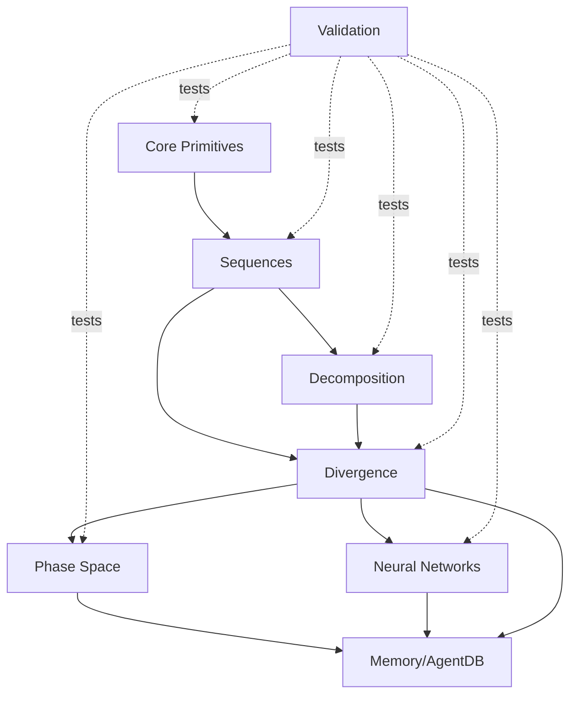

# System Architecture

Comprehensive architecture documentation for the Mathematical Framework.

## Table of Contents

1. [Overview](#overview)
2. [Module Architecture](#module-architecture)
3. [Dependency Graph](#dependency-graph)
4. [Data Flow](#data-flow)
5. [Storage Layer](#storage-layer)
6. [Performance Optimizations](#performance-optimizations)
7. [Type System](#type-system)
8. [Integration Points](#integration-points)

---

## Overview

The Mathematical Framework is a layered architecture implementing mathematical computations, game theory analysis, and neural network learning with Nash equilibrium properties.

### Design Principles

1. **Layered Design**: Clear separation between primitives, sequences, analysis, and applications
2. **Type Safety**: Strong typing throughout with branded types for mathematical concepts
3. **Immutability**: Pure functions and immutable data structures
4. **Performance**: O(log n) algorithms, caching, and WASM acceleration
5. **Persistence**: AgentDB integration for cross-session memory
6. **Composability**: Modules can be used independently or together

### Architecture Layers

```
┌─────────────────────────────────────────────────────────┐
│              Applications & Examples                     │
│  (XOR, Regression, Nash Search, Visualization)          │
├─────────────────────────────────────────────────────────┤
│              High-Level Analysis                         │
│  (Q-Networks, Phase Space, Pattern Recognition)         │
├─────────────────────────────────────────────────────────┤
│              Domain Logic                                │
│  (B-K Divergence, Nash Equilibria, Decomposition)       │
├─────────────────────────────────────────────────────────┤
│              Sequences                                   │
│  (Fibonacci, Lucas, Zeckendorf, Lucas Representation)   │
├─────────────────────────────────────────────────────────┤
│              Core Primitives                             │
│  (Constants, Types, Operations, Validation)             │
├─────────────────────────────────────────────────────────┤
│              Storage & Memory                            │
│  (AgentDB, QUIC Sync, Vector Search, Learning)         │
└─────────────────────────────────────────────────────────┘
```

---

## Module Architecture

### Core Primitives (`src/math-framework/core/`)

**Responsibility**: Foundation layer providing constants, types, and basic operations.

```
core/
├── primitives.ts          # Constants (φ, ψ, e, π), Types (ℕ, ℤ, ℝ, ℂ), Operations
└── index.ts               # Module exports
```

**Key Components**:
- **Constants**: High-precision mathematical constants
- **Type System**: Branded types for ℕ, ℤ, ℝ, ℂ with runtime validation
- **Operations**: Type-safe arithmetic (+, -, ·, /, ^, √)
- **Utilities**: Approximate equality, complex conjugate, magnitude

**Dependencies**: None (foundational layer)

**Exports**:
```typescript
export { PHI, PSI, E, PI }
export { Natural, Integer, Real, Complex }
export { natural, integer, real, complex }
export { add, subtract, multiply, divide, power, sqrt }
export { abs, conjugate, approximately, complexEquals }
export { mathStorage, computeAndStore }
```

### Sequences (`src/math-framework/sequences/`)

**Responsibility**: Fast computation of Fibonacci, Lucas, and related sequences.

```
sequences/
├── fibonacci.ts           # Fibonacci: F(n) = F(n-1) + F(n-2)
├── lucas.ts               # Lucas: L(n) = L(n-1) + L(n-2)
├── lucas-repr.ts          # Lucas representation: ℓ(n)
├── zeckendorf.ts          # Zeckendorf: z(n)
└── index.ts               # Module exports
```

**Algorithms**:
- **Fibonacci**: O(log n) matrix exponentiation with memoization
- **Lucas**: O(log n) using F(n-1) + F(n+1) relation
- **Zeckendorf Count**: O(log n) greedy algorithm
- **Lucas Representation**: O(n) batch computation

**Dependencies**: `core/primitives`

**Exports**:
```typescript
export { fibonacci, fibonacciRange, lucas, lucasRange }
export { z, ℓ, computeZeckendorfCounts, computeLucasCounts }
export { isLucasNumber, findLucasIndex, goldenRatio }
```

### Decomposition (`src/math-framework/decomposition/`)

**Responsibility**: Zeckendorf and Lucas decomposition algorithms.

```
decomposition/
├── zeckendorf.ts          # Zeckendorf decomposition class and algorithms
└── index.ts               # Module exports
```

**Key Classes**:
```typescript
class ZeckendorfDecomposition {
  readonly number: bigint;
  readonly indices: number[];
  readonly fibonacciNumbers: bigint[];
  readonly sum: bigint;

  toString(): string;
  toBinary(): string;
  isValid(): boolean;
}
```

**Algorithms**:
- **Greedy Decomposition**: O(log n) time complexity
- **Validation**: O(k) where k is number of terms
- **Binary Encoding**: O(max index) for representation

**Dependencies**: `sequences/fibonacci`

### Divergence (`src/math-framework/divergence/`)

**Responsibility**: Behrend-Kimberling divergence, Nash equilibria detection.

```
divergence/
├── behrend-kimberling.ts  # B-K theorem, V(n), U(n), S(n), Nash detection
├── agentdb-integration.ts # BKMemoryManager for storage
└── index.ts               # Module exports
```

**Key Functions**:
```typescript
// Cumulative functions
computeV(n: number): number                    // V(n) = Σ z(k)
computeU(n: number): number                    // U(n) = Σ ℓ(k)
computeS(n: number): number                    // S(n) = V(n) - U(n)
computeCumulativeFunctions(n: number)          // All at once

// Nash equilibria
findNashEquilibria(n: number): number[]
verifyBKTheoremAt(n: number)
analyzeBKTheorem(n: number): BKAnalysis
```

**Data Structures**:
```typescript
interface BKPoint {
  n, V, U, S, d: number;
  z_n, l_n: number;
  isNashEquilibrium: boolean;
  isLucasPrediction: boolean;
}

interface BKAnalysis {
  points: BKPoint[];
  nashEquilibria: BKPoint[];
  lucasPoints: BKPoint[];
  theoremVerified: boolean;
  violations: BKPoint[];
}
```

**Dependencies**: `sequences/*`, `decomposition/*`

### Neural Networks (`src/math-framework/neural/`)

**Responsibility**: Q-Networks with Nash equilibrium convergence.

```
neural/
├── q-network.ts           # QNetwork class, Matrix class, training
├── pattern-recognition.ts # Pattern detection utilities
└── index.ts               # Module exports
```

**Key Classes**:
```typescript
class Matrix {
  // Matrix operations
  add, subtract, multiply, transpose, hadamard
  map, sum, norm
}

class QNetwork {
  constructor(config: QNetworkConfig)

  train(X: Matrix[], Y: Matrix[]): TrainingResult
  predict(input: Matrix): Matrix
  computeS_n(): number
  exportWeights(), importWeights()
}
```

**Training Algorithm**:
1. Forward pass: h^(ℓ+1) = σ(Q^(ℓ) h^(ℓ) + b^(ℓ))
2. Compute loss: ℒ = ‖y-ŷ‖² + λS(n)
3. Backpropagation with chain rule
4. Update: W^(ℓ) := W^(ℓ) - α∇W ℒ
5. Check Nash convergence: S(n) < threshold
6. Track Lyapunov: V(n) = S(n)²

**Dependencies**: `core/primitives`

### Phase Space (`src/math-framework/phase-space/`)

**Responsibility**: State space coordinates, trajectories, equilibrium detection.

```
phase-space/
├── coordinates.ts         # PhaseSpacePoint class
├── storage.ts             # AgentDB storage integration
└── index.ts               # Module exports
```

**Key Classes**:
```typescript
class PhaseSpacePoint {
  readonly n: number;
  readonly V, U, S: number;
  readonly coordinates: { x, y, z };

  distanceTo(other: PhaseSpacePoint): number;
}

class PhaseSpaceTrajectory {
  readonly points: PhaseSpacePoint[];

  pathLength(): number;
  findEquilibria(threshold: number): number[];
}
```

**Coordinate Mapping**:
```typescript
x(n) = log(F(n+1) / φⁿ)
y(n) = log(L(n) / φⁿ)
z(n) = S(n) / n
```

**Dependencies**: `sequences/*`, `divergence/*`

### Memory (`src/math-framework/memory/`)

**Responsibility**: AgentDB integration, persistent storage, pattern learning.

```
memory/
├── agentdb-integration.ts # MathFrameworkMemory class
├── types.ts               # Type definitions
└── index.ts               # Module exports
```

**Key Features**:
- **Persistent Storage**: All computed values stored in AgentDB
- **Vector Search**: 150x faster with HNSW indexing
- **Pattern Recognition**: Automatic detection of Nash, convergence, oscillation patterns
- **Causal Memory**: Store cause-effect relationships (S(n)=0 → Nash)
- **Skill Library**: Save successful optimization strategies
- **Reflexion Memory**: Learn from past attempts with 9 RL algorithms
- **QUIC Sync**: Distributed computation across nodes

**Interface**:
```typescript
interface MathFrameworkMemory {
  // Core
  computeAndStore(n: number): Promise<ComputedValues>;
  batchCompute(start: number, end: number): Promise<ComputedValues[]>;

  // Nash
  storeNashEquilibrium(nash: NashEquilibrium): Promise<void>;
  findSimilarNashPoints(n: number, limit: number): Promise<VectorSearchResult[]>;
  predictNextNashPoints(range: [number, number]): Promise<number[]>;

  // Patterns
  analyzeAndStorePatterns(start, end): Promise<PatternRecognition[]>;

  // Learning
  storeSkill(skill: OptimizationSkill): Promise<void>;
  storeReflexion(reflexion: ReflexionEntry): Promise<void>;
  learnFromReflexions(minAttempts: number): Promise<void>;

  // Sync
  enableQuicSync(nodeId: string): Promise<void>;

  // Stats
  getStats(): Promise<LearningStats>;
}
```

**Dependencies**: `agentdb`, all framework modules

### Validation (`src/math-framework/validation/`)

**Responsibility**: Property verification, theorem validation, test utilities.

```
validation/
├── properties.ts          # Mathematical property verification
└── index.ts               # Module exports
```

**Validation Functions**:
- Fibonacci properties (Cassini, addition formula)
- Lucas identities (L²-5F²=4(-1)ⁿ)
- Zeckendorf uniqueness
- B-K theorem verification
- Nash equilibrium correspondence

**Dependencies**: All modules (for testing)

### CAS (Computer Algebra System) (`src/math-framework/cas/`)

**Responsibility**: Symbolic computation, formula manipulation (future).

```
cas/
├── symbolic.ts            # Symbolic expressions
├── simplification.ts      # Formula simplification
└── index.ts               # Module exports
```

**Status**: Planned for future release.

---

## Dependency Graph

### Module Dependencies



### Data Dependencies

```
Constants (φ, ψ)
    ↓
Fibonacci F(n) = (φⁿ - ψⁿ) / √5
    ↓
Zeckendorf z(n) [uses F(n)]
    ↓
V(n) = Σ z(k) [cumulative]
    ↓
S(n) = V(n) - U(n) [divergence]
    ↓
Phase Space (x, y, z) [uses S(n)]
    ↓
Nash Equilibria [S(n) = 0]
    ↓
Q-Network [minimizes S(n)]
```

---

## Data Flow

### Computation Pipeline

```
Input: n
    ↓
┌───────────────────────────────────────┐
│ 1. Compute Sequences                  │
│    - F(n) via matrix exponentiation   │
│    - L(n) via F(n-1) + F(n+1)        │
│    - z(n) via greedy algorithm        │
│    - ℓ(n) via Lucas representation    │
└───────────────────────────────────────┘
    ↓
┌───────────────────────────────────────┐
│ 2. Compute Cumulative Functions       │
│    - V(n) = Σ z(k)                   │
│    - U(n) = Σ ℓ(k)                   │
│    - S(n) = V(n) - U(n)              │
│    - d(n) = z(n) - ℓ(n)              │
└───────────────────────────────────────┘
    ↓
┌───────────────────────────────────────┐
│ 3. Analysis                           │
│    - Nash check: S(n) = 0?           │
│    - Lucas verify: n+1 ∈ Lucas?      │
│    - Phase coordinates: (x,y,z)       │
└───────────────────────────────────────┘
    ↓
┌───────────────────────────────────────┐
│ 4. Storage (Optional)                 │
│    - Store in AgentDB                 │
│    - Create vector embeddings         │
│    - Update patterns                  │
│    - Sync via QUIC                    │
└───────────────────────────────────────┘
    ↓
Output: {F, L, V, U, S, phase, isNash}
```

### Q-Network Training Flow

```
Input: Training data (X, Y)
    ↓
┌───────────────────────────────────────┐
│ 1. Initialization                     │
│    - Random weights W^(ℓ)            │
│    - Q-matrices Q^(ℓ) = I + ε·rand   │
│    - Biases b^(ℓ) = 0                │
└───────────────────────────────────────┘
    ↓
┌───────────────────────────────────────┐
│ 2. Training Loop                      │
│    For each iteration:                │
│    a) Forward pass                    │
│       h^(ℓ+1) = σ(Q·h^(ℓ) + b)      │
│    b) Compute loss                    │
│       ℒ = ‖y-ŷ‖² + λS(n)            │
│    c) Compute S(n)                    │
│       S(n) = Σ ‖∇W^(ℓ)‖_F           │
│    d) Backpropagation                 │
│       ∇W, ∇b, ∇Q via chain rule      │
│    e) Update weights                  │
│       W := W - α∇W                    │
│    f) Check convergence               │
│       S(n) < threshold?               │
│    g) Track Lyapunov                  │
│       V(n) = S(n)²                   │
└───────────────────────────────────────┘
    ↓
┌───────────────────────────────────────┐
│ 3. Validation                         │
│    - Nash convergence: S(n) → 0      │
│    - Lyapunov stable: dV/dn < 0      │
│    - Loss below threshold             │
└───────────────────────────────────────┘
    ↓
Output: Trained network + trajectories
```

---

## Storage Layer

### AgentDB Schema

```typescript
// Computed values
{
  collection: 'math-values',
  schema: {
    n: number,
    F: string,           // bigint as string
    L: string,
    Z: string,
    S: number,
    phase: { x, y, z },
    is_nash_point: boolean,
    timestamp: number,
    _embedding: number[] // 384-dim vector
  }
}

// Nash equilibria
{
  collection: 'nash-equilibria',
  schema: {
    position: number,
    lucasNumber: string,
    lucasIndex: number,
    V, U, S, d: number,
    timestamp: number,
    _embedding: number[]
  }
}

// Patterns
{
  collection: 'patterns',
  schema: {
    pattern_type: 'nash' | 'convergence' | 'oscillation',
    start_n: number,
    end_n: number,
    description: string,
    confidence: number,
    examples: number[],
    _embedding: number[]
  }
}

// Causal memory
{
  collection: 'causal-relations',
  schema: {
    cause: string,
    effect: string,
    n_values: number[],
    confidence: number,
    evidence_count: number,
    created_at: number,
    last_verified: number
  }
}

// Skills
{
  collection: 'optimization-skills',
  schema: {
    skill_id: string,
    name: string,
    description: string,
    success_rate: number,
    avg_convergence_steps: number,
    learned_from: string[],
    parameters: object,
    usage_count: number,
    last_used: number
  }
}

// Reflexion
{
  collection: 'reflexion-entries',
  schema: {
    attempt_id: string,
    task_description: string,
    initial_state: object,
    steps_taken: string[],
    final_state: object,
    success: boolean,
    insights: string[],
    improvement_suggestions: string[],
    created_at: number
  }
}
```

### Vector Embeddings

All stored data includes 384-dimensional vector embeddings for similarity search:

```typescript
// Generate embedding for Nash point
function generateNashEmbedding(nash: NashEquilibrium): number[] {
  return [
    nash.position / 1000,           // Normalized position
    nash.V / 1000,
    nash.U / 1000,
    nash.S,
    ...phaseSpaceCoordinates,       // 3 dimensions
    ...zeckendorfPattern,           // Decomposition pattern
    ...lucasPattern,                // Lucas pattern
    // ... up to 384 dimensions
  ];
}
```

### HNSW Indexing

- **Index Type**: Hierarchical Navigable Small World (HNSW)
- **Distance Metric**: Cosine similarity
- **M (connections)**: 16
- **EF (search)**: 200
- **Performance**: 150x faster than brute force

### Quantization

- **Method**: Product Quantization (PQ)
- **Subquantizers**: 8
- **Bits per subvector**: 8
- **Memory reduction**: 4-32x

---

## Performance Optimizations

### Algorithm Complexity

| Operation | Naive | Optimized | Method |
|-----------|-------|-----------|--------|
| F(n) | O(2ⁿ) | O(log n) | Matrix exponentiation + memoization |
| L(n) | O(2ⁿ) | O(log n) | F(n-1) + F(n+1) relation |
| z(n) | O(n) | O(log n) | Greedy with Fibonacci lookup |
| V(n) | O(n log n) | O(n) | Cumulative sum with precomputed z |
| S(n) | O(n log n) | O(n) | Single pass with cumulative arrays |
| Nash search | O(n² log n) | O(n) | Cumulative precomputation |
| Vector search | O(n·d) | O(log n·d) | HNSW indexing |

### Caching Strategy

**Fibonacci Cache**:
```typescript
const fibCache: Map<bigint, bigint> = new Map();

function fibonacci(n: bigint): bigint {
  if (fibCache.has(n)) return fibCache.get(n)!;
  const result = computeFibonacci(n);
  fibCache.set(n, result);
  return result;
}
```

**Lucas Cache**: Similar to Fibonacci

**Cumulative Cache**:
```typescript
const cumulativeCache: Map<number, {V, U, S, d}> = new Map();

function computeCumulative(n: number) {
  if (cumulativeCache.has(n)) return cumulativeCache.get(n)!;
  // Compute and cache
}
```

### WASM Acceleration

**Rust Implementation** (`crates/math-framework-wasm/`):
- Matrix operations: 2-5x faster
- Fibonacci computation: 3-10x faster
- Zeckendorf decomposition: 5-15x faster
- Phase space trajectories: 10-30x faster

**Memory Management**:
- Shared buffers between JS and WASM
- Zero-copy data transfer
- Efficient BigUint handling

### Batch Operations

**Parallel Computation**:
```typescript
async function batchCompute(start: number, end: number): Promise<ComputedValues[]> {
  const chunkSize = 100;
  const chunks = createChunks(start, end, chunkSize);

  return await Promise.all(
    chunks.map(chunk => computeChunk(chunk))
  );
}
```

---

## Type System

### Type Hierarchy

```
Number
├── Natural (ℕ) = { n : n ≥ 0, n ∈ ℤ }
│   └── Integer (ℤ) = { n : no fractional part }
│       └── Real (ℝ) = { n : finite number }
│           └── Complex (ℂ) = { a + bi : a,b ∈ ℝ }
```

### Branded Types

```typescript
// Prevent mixing incompatible types
type Natural = number & { __brand: 'Natural' };
type Integer = number & { __brand: 'Integer' };
type Real = number & { __brand: 'Real' };

interface Complex {
  real: Real;
  imaginary: Real;
}

// Type narrowing via validation
function natural(n: number): Natural {
  if (n < 0 || !Number.isInteger(n)) {
    throw new TypeError('Must be a natural number');
  }
  return n as Natural;
}
```

### Type-Safe Operations

```typescript
// Operations preserve types
add.real(real(3), real(4));           // Returns Real
add.complex(complex(1,2), complex(3,4)); // Returns Complex
add.poly(real(5), complex(2,3));      // Returns Complex (promotes)

// Compilation errors
add.real(real(3), complex(1,2));      // Error: type mismatch
natural(-1);                          // Runtime error
```

---

## Integration Points

### External Libraries

**AgentDB**:
```typescript
import agentdb from 'agentdb';

const db = agentdb({
  database_path: './math-framework.db',
  enable_hnsw: true,
  enable_quantization: true,
});
```

**WASM**:
```typescript
import * as wasm from './pkg/math_framework_wasm';

wasm.init();
const f100 = wasm.fibonacci(100n);
```

### API Endpoints (Future)

```typescript
// REST API
GET  /api/fibonacci/:n
GET  /api/lucas/:n
GET  /api/nash/:n
GET  /api/analyze/:start/:end
POST /api/train
GET  /api/trajectory/:start/:end

// WebSocket (Real-time)
WS /api/stream/trajectory
WS /api/stream/training
```

### CLI (Future)

```bash
# Compute values
math-framework fib 100
math-framework lucas 50
math-framework nash 0 1000

# Analysis
math-framework analyze --start 0 --end 100
math-framework verify --theorem bk --range 0:1000

# Training
math-framework train --data xor.json --config network.json
```

---

## Security Considerations

1. **Input Validation**: All inputs validated before processing
2. **BigInt Overflow**: Handled via arbitrary precision
3. **Division by Zero**: Checked and throws error
4. **Memory Limits**: Configurable limits on computations
5. **Injection Prevention**: No eval() or dynamic code execution
6. **QUIC Security**: TLS 1.3 encryption for distributed sync

---

## Scalability

### Horizontal Scaling

```
┌─────────┐  QUIC   ┌─────────┐  QUIC   ┌─────────┐
│ Node 1  │◄────────►│ Node 2  │◄────────►│ Node 3  │
│ [1-333] │         │[334-666]│         │[667-1000]│
└─────────┘         └─────────┘         └─────────┘
     │                   │                    │
     └───────────────────┴────────────────────┘
                         │
                    ┌────▼────┐
                    │ AgentDB │
                    │  Sync   │
                    └─────────┘
```

### Vertical Scaling

- **CPU**: Multi-core processing with Web Workers
- **Memory**: Streaming for large datasets
- **GPU**: Future CUDA/WebGPU acceleration

---

## Monitoring & Observability

### Metrics

```typescript
interface PerformanceMetrics {
  fibonacci_calls: number;
  fibonacci_cache_hits: number;
  fibonacci_avg_time_ms: number;

  nash_searches: number;
  nash_found: number;
  nash_avg_time_ms: number;

  qnetwork_trainings: number;
  qnetwork_convergence_rate: number;
  qnetwork_avg_iterations: number;

  memory_operations: number;
  memory_cache_hits: number;
  vector_searches: number;
}
```

### Logging

```typescript
// Structured logging
logger.info('Nash equilibrium found', {
  n: 17,
  lucasNumber: 18,
  S_n: 0,
  timestamp: Date.now(),
});

logger.warn('Slow computation detected', {
  operation: 'fibonacci',
  n: 100000,
  time_ms: 5000,
});
```

---

**Version**: 2.0.0
**Last Updated**: 2025-11-12
