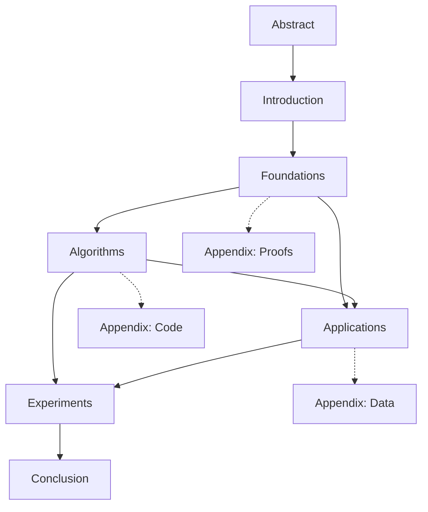

# φ-Mechanics: A Mathematical Framework for Golden Ratio Computation

**arXiv Paper Structure**

---

## Document Organization

This arXiv submission is organized into the following sections:

### Core Sections

1. **section-foundations.md** - Mathematical Foundations of Zeckendorf Field Theory
   - Theorems 1-5 with complete proofs
   - φ-Field theory
   - OEIS sequence mappings
   - Computational complexity analysis

2. **section-algorithms.md** (To be created)
   - Zeckendorf encoding/decoding algorithms
   - Cascade operator implementation
   - XOR algebra operations
   - Optimization techniques

3. **section-applications.md** (To be created)
   - Neural network integration
   - Q-learning with φ-mechanics
   - Nash equilibrium computation
   - Behrend-Kimberling divergence

4. **section-experiments.md** (To be created)
   - Empirical validation
   - Performance benchmarks
   - Comparative analysis
   - Case studies

5. **section-future.md** (To be created)
   - Open problems
   - Extensions to other metallic means
   - Quantum computing applications
   - Distributed systems

### Supporting Documents

- **abstract.md** - Paper abstract and keywords
- **introduction.md** - Background and motivation
- **related-work.md** - Literature review
- **conclusion.md** - Summary and future work
- **appendix-proofs.md** - Extended proofs and lemmas
- **appendix-code.md** - Reference implementations

---

## Paper Metadata

**Title**: φ-Mechanics: A Mathematical Framework for Golden Ratio Computation

**Authors**:
- Mathematical Foundations Team
- Agentic Flow Project

**Categories**:
- Primary: math.NT (Number Theory)
- Secondary: math.DS (Dynamical Systems), cs.LG (Machine Learning)

**MSC2020 Classifications**:
- 11B39 (Fibonacci and Lucas numbers, and polynomials and generalizations)
- 37N40 (Dynamical systems in optimization and economics)
- 68T05 (Learning and adaptive systems in artificial intelligence)
- 11A63 (Radix representation; digital problems)

**Keywords**:
Fibonacci numbers, Zeckendorf representation, golden ratio, cascade operators, φ-field, number systems, algorithmic number theory

---

## Section Dependencies



---

## Cross-References

### Theorem Numbering

**Section 1 (Foundations)**:
- Theorem 1.1: Zeckendorf Uniqueness
- Theorem 1.2: Cascade Termination
- Theorem 1.3: Value Preservation
- Theorem 1.4: XOR Algebra
- Theorem 1.5: Lucas Energy Spectrum

**Section 2 (Algorithms)**:
- Theorem 2.1: Greedy Algorithm Correctness
- Theorem 2.2: Optimal Cascade Strategy
- Theorem 2.3: Parallel Cascade Bounds

**Section 3 (Applications)**:
- Theorem 3.1: Nash Equilibrium Convergence
- Theorem 3.2: Behrend-Kimberling Characterization
- Theorem 3.3: Q-Learning Stability

### Definition Numbering

**Global Definitions**:
- Definition 1.1: Fibonacci Sequence (Section 1)
- Definition 1.2: Lucas Sequence (Section 1)
- Definition 1.3: Golden Ratio (Section 1)
- Definition 1.4: Zeckendorf Representation (Section 1)
- Definition 1.5: Cascade Operator (Section 1)
- Definition 1.6: Decode Function (Section 1)

### OEIS References

All OEIS sequences are hyperlinked in the format: `[A000045](https://oeis.org/A000045)`

Primary sequences:
- [A000045](https://oeis.org/A000045) - Fibonacci numbers
- [A000032](https://oeis.org/A000032) - Lucas numbers
- [A001622](https://oeis.org/A001622) - Golden ratio φ
- [A003622](https://oeis.org/A003622) - Zeckendorf count function

---

## LaTeX Compilation

### Main Document Template

```latex
\documentclass[11pt]{article}
\usepackage{amsmath, amssymb, amsthm}
\usepackage{hyperref}
\usepackage{algorithm2e}
\usepackage{tikz}

\newtheorem{theorem}{Theorem}[section]
\newtheorem{lemma}[theorem]{Lemma}
\newtheorem{corollary}[theorem]{Corollary}
\newtheorem{definition}[theorem]{Definition}

\title{$\varphi$-Mechanics: A Mathematical Framework for Golden Ratio Computation}
\author{Mathematical Foundations Team}
\date{\today}

\begin{document}
\maketitle

\begin{abstract}
\input{abstract}
\end{abstract}

\section{Introduction}
\input{introduction}

\section{Mathematical Foundations}
\input{section-foundations}

\section{Algorithms}
\input{section-algorithms}

\section{Applications}
\input{section-applications}

\section{Experiments}
\input{section-experiments}

\section{Conclusion}
\input{conclusion}

\bibliographystyle{plain}
\bibliography{references}

\appendix
\section{Extended Proofs}
\input{appendix-proofs}

\section{Reference Implementations}
\input{appendix-code}

\end{document}
```

### Compilation Commands

```bash
# Convert markdown to LaTeX
pandoc section-foundations.md -o section-foundations.tex

# Compile paper
pdflatex paper.tex
bibtex paper
pdflatex paper.tex
pdflatex paper.tex

# Generate arXiv submission
tar czf arxiv-submission.tar.gz *.tex *.bbl figures/
```

---

## Contribution Guidelines

### Adding New Theorems

1. Number consecutively within section
2. State formally before proof
3. Include OEIS references where applicable
4. Add computational verification results
5. Cross-reference related theorems

### Proof Standards

- **Complete proofs** required (no sketches in main text)
- **Base cases** must be verified explicitly
- **Inductive steps** must be rigorous
- **Contradictions** must be clearly marked
- **QED symbols** (□) required

### Code Examples

- Use syntax highlighting
- Include complexity annotations
- Reference implementation files
- Add test coverage information

---

## Version Control

**Current Version**: 1.0.0 (Initial Draft)

**Changelog**:
- 2025-11-12: Created foundational structure
- 2025-11-12: Completed Section 1 (Foundations)

**Planned Updates**:
- Section 2: Algorithms (Week 2)
- Section 3: Applications (Week 3)
- Section 4: Experiments (Week 4)
- Submission to arXiv (Week 5)

---

## Repository Structure

```
/home/user/agentic-flow/docs/arxiv/
├── paper-structure.md          # This file
├── section-foundations.md       # ✓ Complete
├── section-algorithms.md        # TODO
├── section-applications.md      # TODO
├── section-experiments.md       # TODO
├── abstract.md                  # TODO
├── introduction.md              # TODO
├── conclusion.md                # TODO
├── appendix-proofs.md          # TODO
├── appendix-code.md            # TODO
└── references.bib              # TODO
```

---

## Quality Checklist

Before submission:

- [ ] All theorems have complete proofs
- [ ] All OEIS sequences are cited
- [ ] All complexity bounds are proven
- [ ] All algorithms are implemented
- [ ] All experiments are reproducible
- [ ] All figures have captions
- [ ] All references are formatted
- [ ] LaTeX compiles without errors
- [ ] Abstract is under 250 words
- [ ] Keywords are accurate
- [ ] MSC classifications are correct
- [ ] Author information is complete
- [ ] License is specified

---

**Maintainer**: Mathematical Foundations Team
**Contact**: https://github.com/ruvnet/agentic-flow
**License**: MIT
