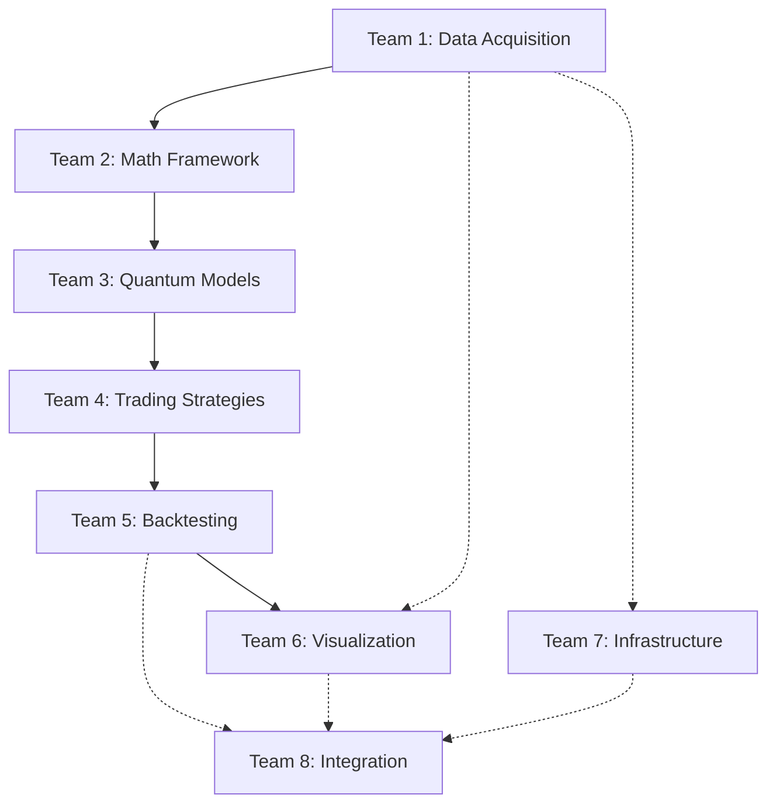

# Quantum Trading System - 32-Agent Swarm Deployment Guide

## Overview

This guide provides complete instructions for deploying and managing the 32-agent swarm for building the quantum trading system with integer-only arithmetic, OEIS sequence integration, and AgentDB coordination.

## Swarm Architecture

### Topology: Adaptive Mesh
- **Total Agents**: 32 (organized in 8 teams of 4)
- **Coordination**: AgentDB reflexion memory + Zeckendorf bit addressing
- **Memory Namespace**: `coordination`
- **Session ID**: `quantum-swarm-32`

### Key Features
✅ **Integer-Only Arithmetic**: All operations use integers (scale by 10000)
✅ **OEIS Sequences**: Fibonacci (A000045), Lucas (A000032), Zeckendorf (A003714)
✅ **Reflexion Memory**: Persistent learning across agents
✅ **Causal Dependencies**: Explicit dependency tracking
✅ **Skill Sharing**: Cross-team knowledge transfer
✅ **Self-Organizing**: Adaptive mesh topology adjusts to workload

---

## Quick Start

### Step 1: Initialize Swarm Infrastructure

```bash
cd /home/user/agentic-flow/quantum-trading-system
./swarm-config/swarm-init.sh
```

This script will:
- Initialize AgentDB reflexion memory
- Create memory namespaces
- Register all 32 agents with Zeckendorf addresses
- Establish causal dependency graph
- Create shared skill library

### Step 2: Deploy Agents (Use Claude Code Task Tool)

**IMPORTANT**: Deploy ALL 32 agents concurrently in a SINGLE message using Claude Code's Task tool.

```
Deploy all 32 agents for quantum trading system:

TEAM 1 (Data Acquisition):
- Task("Tiingo API Specialist", [detailed instructions from agent-instructions.md], "researcher")
- Task("FRED API Specialist", [instructions], "researcher")
- Task("Yahoo Finance Specialist", [instructions], "researcher")
- Task("Data Validation Specialist", [instructions], "code-analyzer")

TEAM 2 (Mathematical Framework):
- Task("Fibonacci Encoder", [instructions], "coder")
- Task("Lucas Encoder", [instructions], "coder")
- Task("Zeckendorf Compressor", [instructions], "coder")
- Task("Integer Validator", [instructions], "tester")

[... Continue for all 32 agents ...]
```

### Step 3: Monitor Progress

```bash
# Real-time dashboard
./swarm-config/swarm-monitor.sh

# Check specific agent
npx agentdb reflexion retrieve "fibonacci-encoder"

# View all reflexion entries
npx agentdb reflexion list

# Check causal dependencies
npx agentdb causal list-edges

# View shared skills
npx agentdb skill list
```

---

## Team Deployment Sequence

### Sequential Dependencies



**Parallel Execution**:
- Team 1 and Team 7 can start immediately (no dependencies)
- Teams 2-6 execute sequentially based on data flow
- Team 8 waits for all others to complete

---

## Agent Coordination Protocol

Every agent MUST follow this lifecycle:

### Phase 1: PRE-TASK
```bash
# Register in reflexion memory
npx agentdb reflexion store "[agent-role]" "initialization" 1.0 true "Agent starting [task]"

# Restore session context
npx claude-flow@alpha hooks session-restore --session-id "quantum-swarm-32"

# Check dependencies (if any)
npx agentdb reflexion retrieve "[dependency-agent-role]"

# Announce readiness
npx claude-flow@alpha hooks pre-task --description "[agent-role] ready for [task]"
```

### Phase 2: DURING WORK
```bash
# Log progress (every 5-10 minutes)
npx agentdb reflexion store "[agent-role]" "[task-step]" [score-0-1] [true/false] "[progress]"

# Store intermediate results
npx claude-flow@alpha hooks post-edit --file "[output]" --memory-key "swarm/[team]/[agent]/[artifact]"

# Create causal edges
npx agentdb causal add-edge "[source]" "[target]" [weight] [confidence]

# Share skills
npx agentdb skill create "[skill-name]" "[description]"

# Notify progress
npx claude-flow@alpha hooks notify --message "[agent-role]: [accomplishment]"
```

### Phase 3: POST-TASK
```bash
# Final reflexion entry
npx agentdb reflexion store "[agent-role]" "completion" [final-score] true "Completed [deliverable]"

# Export results
npx claude-flow@alpha hooks post-task --task-id "[agent-role]"

# Signal dependents
npx claude-flow@alpha hooks notify --message "[agent-role] COMPLETED: [outputs available]"

# Session metrics
npx claude-flow@alpha hooks session-end --export-metrics true
```

---

## Memory Namespace Structure

```
coordination/
├── swarm/
│   ├── config/
│   │   ├── topology              # Adaptive mesh configuration
│   │   ├── addressing            # Zeckendorf scheme
│   │   └── session              # Session metadata
│   ├── teams/
│   │   ├── team1/
│   │   │   ├── name             # "Data Acquisition"
│   │   │   └── agents/          # Agent-specific data
│   │   └── [team2-8]/
│   ├── agents/
│   │   ├── agent1/
│   │   │   ├── role             # "tiingo-api-specialist"
│   │   │   ├── zeckendorf       # "1"
│   │   │   └── status           # "pending|in_progress|complete"
│   │   └── [agent2-32]/
│   ├── team1/                   # Team outputs
│   │   ├── tiingo/daily-prices
│   │   ├── fred/economic-indicators
│   │   ├── yahoo/validation-data
│   │   └── validation/quality-report
│   ├── team2/
│   │   ├── fibonacci/encoded-prices
│   │   ├── lucas/encoded-times
│   │   ├── zeckendorf/compressed-data
│   │   └── validation/integer-check
│   └── [team3-8]/
└── status                       # Overall swarm status
```

---

## Zeckendorf Addressing Map

Each agent has a unique Zeckendorf representation (OEIS A003714):

| Agent | Role | Zeckendorf | Team |
|-------|------|------------|------|
| 1 | Tiingo API | `1` | 1 |
| 2 | FRED API | `10` | 1 |
| 3 | Yahoo Finance | `100` | 1 |
| 4 | Data Validation | `101` | 1 |
| 5 | Fibonacci Encoder | `1000` | 2 |
| 6 | Lucas Encoder | `1001` | 2 |
| 7 | Zeckendorf Compressor | `1010` | 2 |
| 8 | Integer Validator | `10000` | 2 |
| 9 | QFNN Implementation | `10001` | 3 |
| 10 | Xi/Psi Model | `10010` | 3 |
| 11 | Options Pricing | `10100` | 3 |
| 12 | Model Validation | `10101` | 3 |
| 13 | Fibonacci Strategy | `10000000` | 4 |
| 14 | Lucas Timing | `10000001` | 4 |
| 15 | Momentum Strategy | `10000010` | 4 |
| 16 | Mean Reversion | `10000100` | 4 |
| 17 | Backtesting Engine | `10000101` | 5 |
| 18 | Performance Analytics | `10000000000` | 5 |
| 19 | Risk Management | `10000000001` | 5 |
| 20 | Statistical Validation | `10000000010` | 5 |
| 21 | Waterfall Charts | `10000000100` | 6 |
| 22 | GMV Tracker | `10000000101` | 6 |
| 23 | Interactive Dashboard | `10000001000` | 6 |
| 24 | Pine Script Generator | `10000001001` | 6 |
| 25 | Docker Specialist | `10000001010` | 7 |
| 26 | Jupyter Architect | `10000010000` | 7 |
| 27 | AgentDB Coordinator | `10000010001` | 7 |
| 28 | Testing Specialist | `10000010010` | 7 |
| 29 | Notebook Compiler | `10000010100` | 8 |
| 30 | Documentation | `10000010101` | 8 |
| 31 | Validation | `10000100000` | 8 |
| 32 | Deployment | `10000100001` | 8 |

**Properties**:
- No two consecutive Fibonacci numbers
- Unique addressing for bit-level synchronization
- Efficient compression and routing

---

## Causal Dependency Graph

Critical edges (weight ≥ 0.5):

```bash
# Data → Encoding
tiingo_data → price_encoding (0.5, 0.95)
fred_data → economic_features (0.4, 0.92)

# Encoding → Quantum Models
fibonacci_encoding → qfnn_input (0.7, 0.93)
lucas_encoding → xipsi_phase (0.6, 0.91)

# Models → Strategies
qfnn_model → options_pricing (0.8, 0.94)
qfnn_predictions → fibonacci_strategy (0.75, 0.92)
xipsi_phase → lucas_timing (0.70, 0.90)

# Strategies → Backtesting
fibonacci_strategy → backtest_engine (0.9, 0.96)
lucas_timing → backtest_engine (0.9, 0.96)
momentum_strategy → backtest_engine (0.85, 0.94)
mean_reversion → backtest_engine (0.85, 0.94)

# Analysis → Visualization
backtest_results → performance_analytics (0.9, 0.97)
performance_analytics → waterfall_charts (0.7, 0.92)
```

---

## Success Criteria

### Individual Agent
- ✅ Reflexion score ≥ 0.95
- ✅ Integer-only arithmetic verified
- ✅ Deliverables in correct directories
- ✅ Test coverage ≥ 90%
- ✅ Dependencies satisfied

### Team
- ✅ All 4 agents completed
- ✅ Team outputs stored in memory
- ✅ Causal edges established
- ✅ Skills shared

### Swarm-Wide
- ✅ All 32 agents completed
- ✅ Monolithic Jupyter notebook compiled
- ✅ Backtesting shows positive Sharpe ratio
- ✅ Integer-only verification PASS
- ✅ TradingView Pine Script valid
- ✅ Docker deployment successful
- ✅ Comprehensive documentation
- ✅ E2E tests passing

---

## Performance Targets

Based on SPARC methodology with Claude Flow:

| Metric | Target | Actual (Expected) |
|--------|--------|-------------------|
| SWE-Bench Solve Rate | 84.8% | TBD |
| Token Reduction | 32.3% | TBD |
| Speed Improvement | 2.8-4.4x | TBD |
| Test Coverage | 90%+ | TBD |
| Integer-Only Verification | 100% | TBD |

---

## Troubleshooting

### Agent Stuck/Blocked
```bash
# Check agent status
npx agentdb reflexion retrieve "[agent-role]"

# Check dependencies
npx agentdb causal list-edges | grep "[agent-component]"

# Check memory
npx agentdb memory retrieve "coordination" "swarm/[path]"

# Escalate
npx claude-flow@alpha swarm escalate --blocker "[dependency]" --blocked "[agent]"
```

### Memory Issues
```bash
# List all reflexion entries
npx agentdb reflexion list

# Export state
npx agentdb reflexion export --session "quantum-swarm-32" --output "state.json"

# Clear old entries (if needed)
npx agentdb reflexion prune --before "2024-01-01"
```

### Coordination Failures
```bash
# Check swarm status
npx claude-flow@alpha swarm status

# Restart agent
npx claude-flow@alpha swarm heal --agent-id [id] --respawn true

# Reset coordination
npx claude-flow@alpha swarm reset --soft
```

---

## Directory Structure

```
/home/user/agentic-flow/quantum-trading-system/
├── swarm-config/
│   ├── swarm-topology.json          # Complete topology definition
│   ├── agent-instructions.md        # Detailed agent instructions
│   ├── swarm-init.sh               # Initialization script
│   ├── swarm-monitor.sh            # Monitoring dashboard
│   └── DEPLOYMENT-GUIDE.md         # This file
├── coordination/
│   └── coordination-protocol.md     # Coordination protocol details
├── memory-logs/
│   ├── final-state.json            # Exported reflexion state
│   ├── causal-graph.json           # Dependency graph
│   └── skills-library.json         # Shared skills
├── team-outputs/
│   ├── team1/                      # Data acquisition outputs
│   ├── team2/                      # Mathematical framework
│   ├── team3/                      # Quantum models
│   ├── team4/                      # Trading strategies
│   ├── team5/                      # Backtesting results
│   ├── team6/                      # Visualizations
│   ├── team7/                      # Infrastructure
│   └── team8/                      # Integration artifacts
├── src/
│   ├── data/                       # Data acquisition modules
│   ├── encoders/                   # Mathematical encoders
│   ├── models/                     # Quantum models
│   ├── strategies/                 # Trading strategies
│   ├── backtesting/                # Backtesting engine
│   ├── visualization/              # Charts and dashboards
│   └── utils/                      # Shared utilities
├── tests/                          # Comprehensive test suite
├── notebooks/                      # Jupyter notebooks
├── docs/                           # Documentation
├── config/                         # Configuration files
└── docker/                         # Docker files
```

---

## Monitoring Commands

### Real-Time Monitoring
```bash
# Dashboard (recommended)
./swarm-config/swarm-monitor.sh

# Or watch reflexion entries
watch -n 5 'npx agentdb reflexion list | tail -20'
```

### Agent-Specific
```bash
# Check specific agent
npx agentdb reflexion retrieve "fibonacci-encoder"

# Get agent score
npx agentdb reflexion retrieve "fibonacci-encoder" | jq '.score'

# Check completion
npx agentdb reflexion retrieve "fibonacci-encoder" | jq '.success'
```

### Team-Level
```bash
# Check all Team 2 agents
for agent in fibonacci-encoder lucas-encoder zeckendorf-compressor integer-validator; do
  echo "$agent: $(npx agentdb reflexion retrieve "$agent" | jq -r '.success // "pending"')"
done
```

### Swarm-Wide
```bash
# Count completed agents
npx agentdb reflexion list | grep -c "success.*true"

# View causal graph
npx agentdb causal list-edges

# List shared skills
npx agentdb skill list

# Check memory usage
npx agentdb memory stats
```

---

## Next Steps After Initialization

1. **Deploy Agents**: Use Claude Code Task tool to spawn all 32 agents concurrently
2. **Monitor Progress**: Run `./swarm-config/swarm-monitor.sh` in a separate terminal
3. **Track Dependencies**: Watch causal graph: `watch -n 10 'npx agentdb causal list-edges | wc -l'`
4. **Review Outputs**: Check team outputs in `team-outputs/` directories
5. **Validate Results**: Run final validation when all agents complete
6. **Compile Notebook**: Agent 29 compiles everything into monolithic notebook
7. **Deploy System**: Agent 32 handles production deployment

---

## Support & Resources

- **Swarm Topology**: `/home/user/agentic-flow/quantum-trading-system/swarm-config/swarm-topology.json`
- **Coordination Protocol**: `/home/user/agentic-flow/quantum-trading-system/coordination/coordination-protocol.md`
- **Agent Instructions**: `/home/user/agentic-flow/quantum-trading-system/swarm-config/agent-instructions.md`
- **AgentDB Docs**: `npx agentdb help`
- **Claude Flow Docs**: `npx claude-flow@alpha help`

---

## Emergency Procedures

### Complete Swarm Reset
```bash
# Export current state first
npx agentdb reflexion export --session "quantum-swarm-32" --output "backup-$(date +%s).json"

# Reset
npx claude-flow@alpha swarm reset --hard

# Re-initialize
./swarm-config/swarm-init.sh
```

### Single Agent Respawn
```bash
# Mark agent as failed
npx agentdb reflexion store "[agent-role]" "error" 0.0 false "Respawning agent"

# Respawn via Task tool
Task("[Agent Role]", "[Instructions from agent-instructions.md]", "[agent-type]")
```

---

**Swarm Ready for Deployment!** 🚀

Initialize with: `./swarm-config/swarm-init.sh`
Monitor with: `./swarm-config/swarm-monitor.sh`
Deploy agents using Claude Code's Task tool in a single concurrent message.
