# System Diagrams - Trading System Architecture

## Mermaid Diagram Definitions
These diagrams can be rendered in any Mermaid-compatible viewer (GitHub, VS Code, etc.)

---

## 1. High-Level System Context

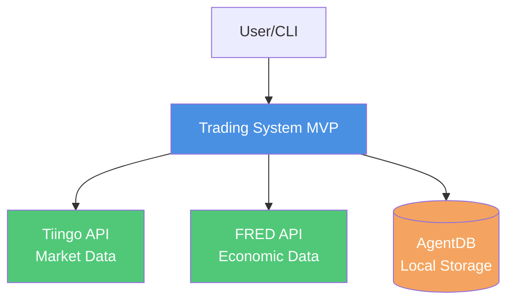

---

## 2. Component Architecture

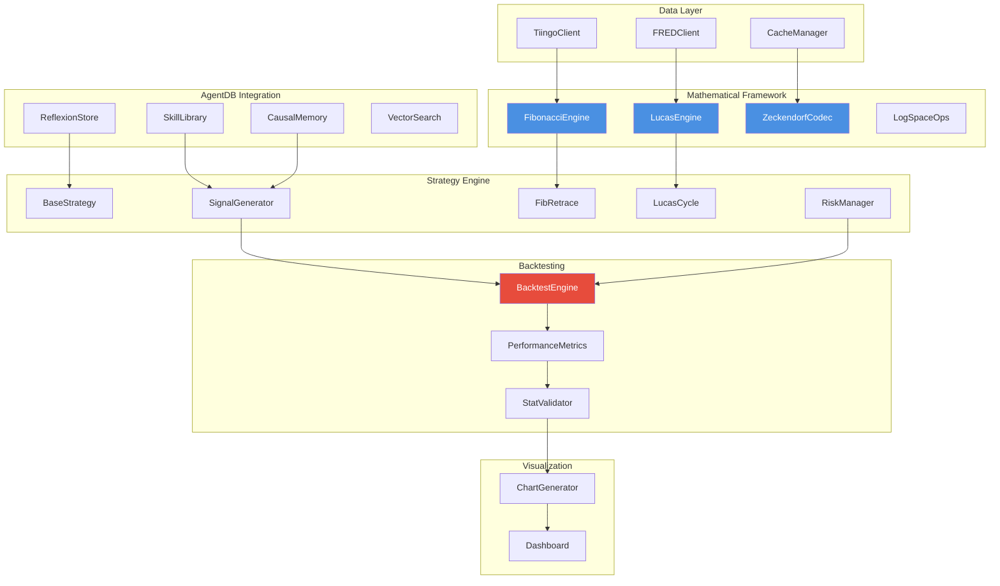

---

## 3. Data Flow Sequence

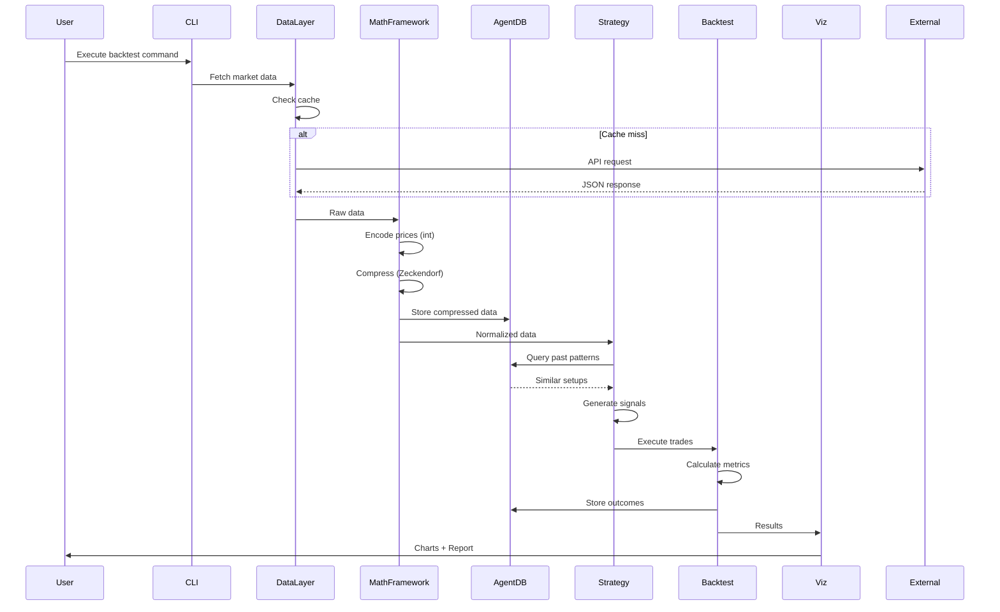

---

## 4. Strategy Signal Generation Flow

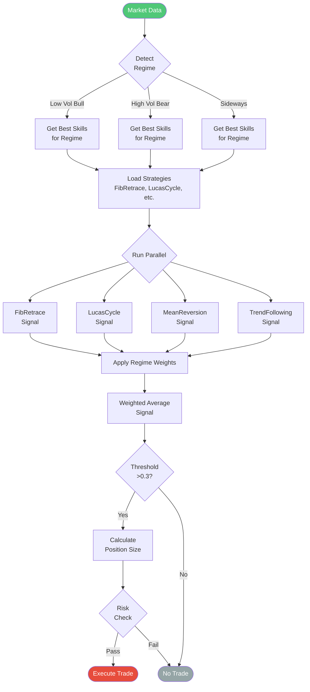

---

## 5. Mathematical Framework Pipeline

```mermaid
flowchart LR
    Price[Price: $178.45] --> Encode[Encode<br/>FibonacciEngine]
    Encode --> Int[Integer: 178450000<br/>cents × 10^6]

    Int --> Calc[Calculate<br/>Fib Levels]
    Calc --> Levels[Levels Array<br/>int64]

    Levels --> Delta[Delta Encode<br/>ZeckendorfCodec]
    Delta --> Zeck[Zeckendorf<br/>Binary String]

    Zeck --> Compress[Compress<br/>to Bytes]
    Compress --> Storage[(AgentDB<br/>Storage)]

    Storage --> Decompress[Decompress<br/>from Bytes]
    Decompress --> Restore[Restore<br/>Integer Array]

    Restore --> Decode[Decode<br/>FibonacciEngine]
    Decode --> Final[Price: $178.45]

    style Price fill:#50c878,color:#fff
    style Int fill:#4a90e2,color:#fff
    style Storage fill:#f4a460,color:#fff
    style Final fill:#50c878,color:#fff
```

---

## 6. AgentDB Learning Loop

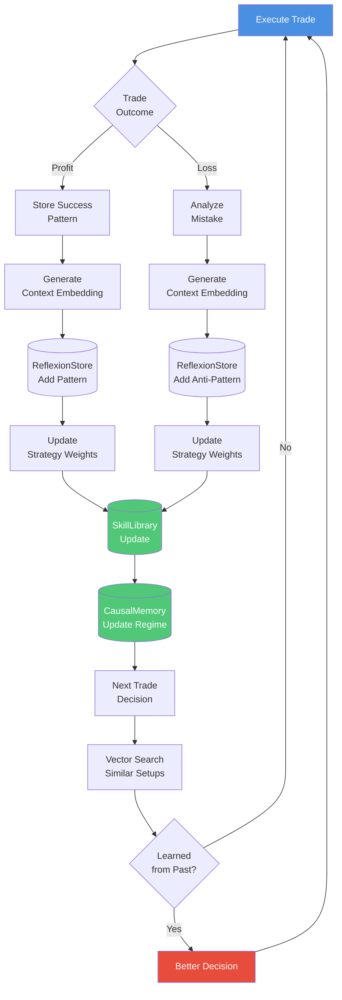

---

## 7. Caching Strategy

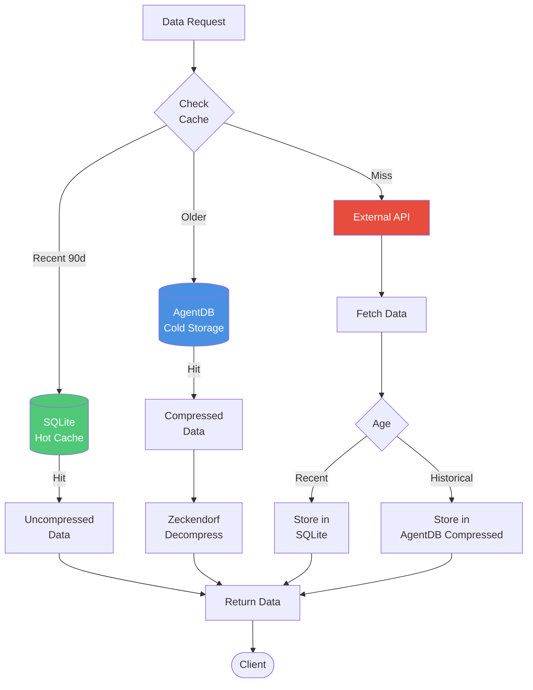

---

## 8. Backtest Execution Timeline

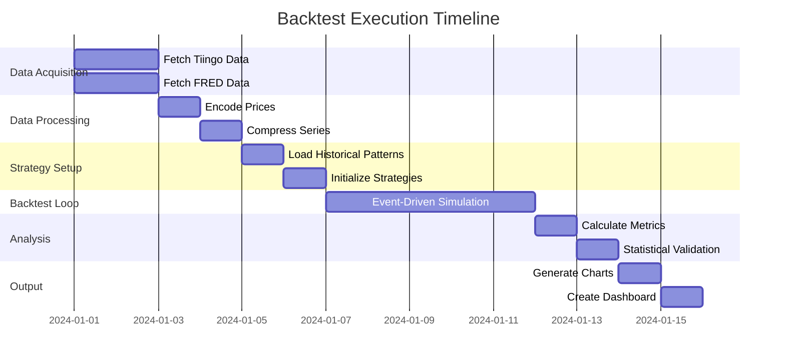

---

## 9. Module Dependency Graph

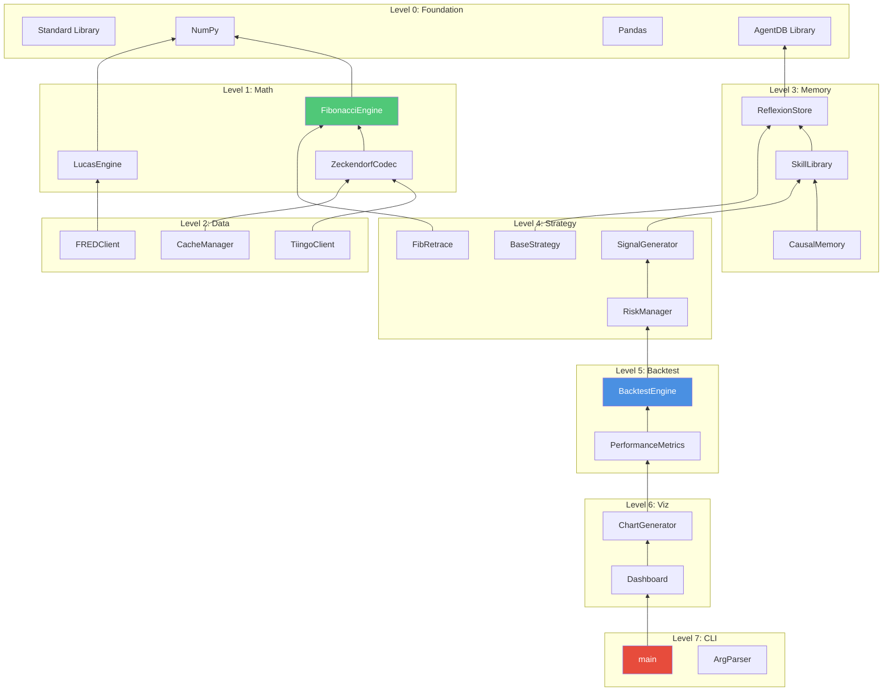

---

## 10. Performance Optimization Layers

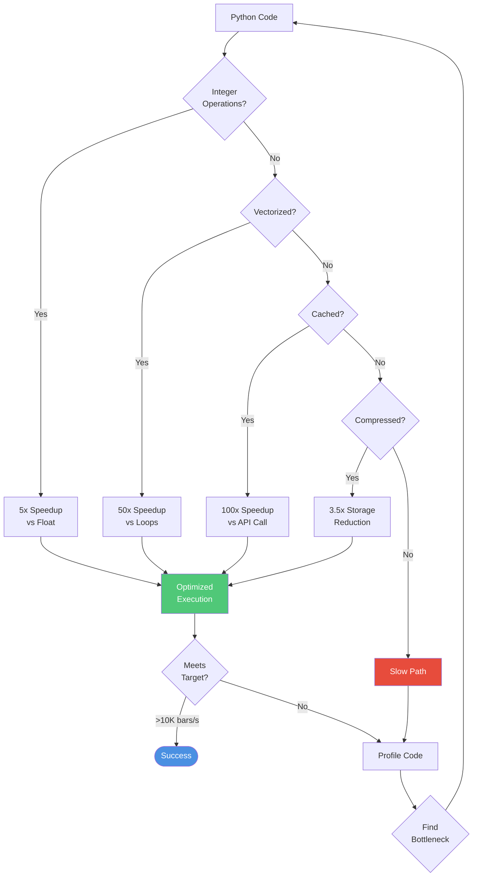

---

## 11. Trade Execution State Machine

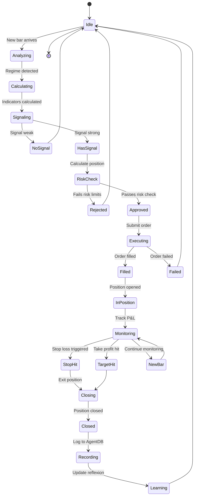

---

## 12. Data Compression Comparison

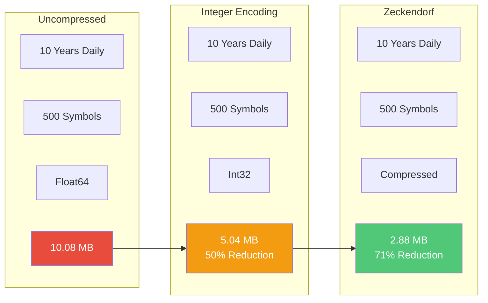

---

## Usage Instructions

To render these diagrams:

1. **GitHub**: Paste into any `.md` file in a GitHub repo
2. **VS Code**: Install "Markdown Preview Mermaid Support" extension
3. **Online**: Use https://mermaid.live/
4. **Documentation sites**: Most support Mermaid natively (GitBook, Docusaurus, etc.)

Example for embedding in documentation:
```markdown
# System Architecture

## Component Diagram
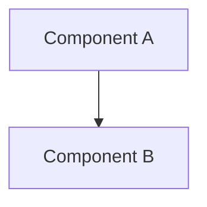
```

The diagrams will render as interactive SVG graphics.
